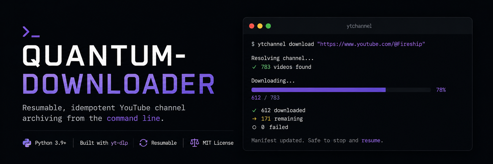

# Quantum-Downloader



### Resumable, idempotent YouTube channel archiving from the command line.

**Quantum-Downloader** (Python package: `ytchannel`) downloads an *entire* YouTube
channel to local storage — every video, organized, resumable, and safe to re-run.
It is a thin orchestration layer over [`yt-dlp`](https://github.com/yt-dlp/yt-dlp),
adding channel-level planning, a manifest of download state, polite rate
limiting, and a clean CLI.

[](https://www.python.org)
[](LICENSE)
[](https://github.com/yt-dlp/yt-dlp)
[](#development)

---

## Table of Contents

- [Why Quantum-Downloader?](#why-quantum-downloader)
- [Quickstart](#quickstart)
- [Features](#features)
- [How it works](#how-it-works)
- [Requirements](#requirements)
- [Installation](#installation)
- [Usage](#usage)
- [Output structure](#output-structure)
- [Configuration](#configuration)
- [Resilience & rate limiting](#resilience--rate-limiting)
- [Limitations](#limitations)
- [Roadmap](#roadmap)
- [Development](#development)
- [License](#license)

> **Scope & legal disclaimer.** This tool is for archiving content you have the
> right to download — your own channel, Creative Commons / public-domain material,
> or content you are otherwise licensed to archive. It is **not** for redistributing
> or pirating copyrighted content you do not have rights to. Respect YouTube's Terms
> of Service and applicable law. Age-restricted or members-only content is only
> accessible with cookies from a session you are legitimately logged into
> (see `--cookies`).

## Why Quantum-Downloader?

Downloading a *single* video is a solved problem. Downloading a *whole channel*
reliably is not:

- Channels can hold hundreds or thousands of videos — you can't fire off downloads
  and hope nothing crashes halfway through.
- Re-running the command shouldn't restart from zero.
- YouTube rate-limits aggressive scraping, so naive parallelism gets you throttled.
- Metadata (titles, dates, thumbnails, subtitles) is often as valuable as the video.

Quantum-Downloader wraps all of that into one repeatable command: **plan →
download → resume → report.**

## Quickstart

Install (pick one):

```bash
pip install quantum-downloader          # Python 3.9+ (recommended)
# or grab ytchannel.exe from GitHub Releases (needs ffmpeg on PATH)
# or: docker build -t quantum-downloader .   # ffmpeg baked in
```

Archive a channel:

```bash
ytchannel index "https://www.youtube.com/@Fireship" -o fireship.json
ytchannel download "https://www.youtube.com/@Fireship" --limit 5
```

Re-run without `--limit` to grab the whole channel, or add `--playlist` to a playlist
URL to archive a playlist instead. Completed videos are always skipped, so it's safe
to re-run anytime.

## Live demo

```console
$ ytchannel index "https://www.youtube.com/@Fireship" -o fireship.json
Exported 783 video(s) from 'Fireship' to fireship.json

$ ytchannel download "https://www.youtube.com/@Fireship" --limit 3
Downloading 3 video(s) from 'Fireship' to ./downloads
# overall + per-video progress bars ...
           Download summary
+------------------------------------+
| Result                     | Count |
|----------------------------+-------+
| Downloaded                 |     3 |
| Skipped (already complete) |     0 |
| Failed                     |     0 |
+------------------------------------+

# Drop --limit to archive the whole channel (Fireship = 783 videos).
# Re-run any time: completed videos are skipped, interrupted runs resume.
```

## Features

- **Whole-channel downloads** — point it at a channel URL and walk away.
- **Playlists too** — pass `--playlist` with a playlist URL, a `watch?v=…&list=…`
  link, or a bare `PL…` id to archive a playlist with the same machinery.
- **Resumable** — state is saved to a manifest after every video; kill the process
  or lose the connection and re-run to continue exactly where you left off.
- **Idempotent** — re-running never re-downloads completed work.
- **Any URL form** — `@handle`, `/c/name`, `/channel/UC…`, `/user/name` are all
  normalized to the channel's `/videos` tab automatically.
- **Metadata export** — `index` writes the full video list to JSON or CSV, no
  downloads required.
- **Polite & resilient** — configurable delay between downloads, exponential backoff
  on transient errors, and permanent failures (private/deleted/region-blocked) are
  recorded and skipped rather than retried forever.
- **One bad video doesn't abort the batch** — failures are collected and reported.
- **Extras** — optional thumbnails, descriptions, subtitles, and cookies for
  members-only / age-restricted content.
- **Config file** — persist common defaults; CLI flags always win.

## How it works

```
   channel URL
        │
        ▼
    resolve  ──►  canonical ID + full video list (fast flat extraction)
        │
        ▼
     plan    ──►  reconcile against the manifest
                   (new → pending, done → skip, crashed → retry)
        │
        ▼
   execute   ──►  download sequentially, update manifest after each video
        │
        ▼
    report   ──►  downloaded / skipped / failed
```

The manifest — not the filesystem — is the source of truth, so a crash or Ctrl-C
never forces a restart from scratch, and renaming or title edits don't cause
re-downloads.

## Requirements

- Python **3.9+**
- [`yt-dlp`](https://github.com/yt-dlp/yt-dlp) (installed automatically)
- [`ffmpeg`](https://ffmpeg.org/) — **required** to merge separate video+audio
  streams and for `--audio-only` (mp3). Install it and put it on your `PATH`.

> **Note:** explicit quality selection (e.g. `--quality 1080p`) benefits from a
> JavaScript runtime (deno or node) for the full format list. The default `best`
> quality works without one.

## Installation

### PyPI (recommended)
Requires Python 3.9+.

```bash
pip install quantum-downloader
ytchannel --version
```

### Docker
`ffmpeg` is baked into the image, so there is no system dependency to install.

```bash
docker build -t quantum-downloader .
docker run --rm -v "$PWD:/data" quantum-downloader \
  ytchannel download "https://www.youtube.com/@Fireship" -o /data
```

### Windows (standalone executable)
Download `ytchannel.exe` from the
[GitHub Releases](https://github.com/beast-ofcourse/Quantum-Downloader/releases) page.
It requires [`ffmpeg`](https://ffmpeg.org/) on your `PATH`.

### From source
```bash
git clone https://github.com/beast-ofcourse/Quantum-Downloader.git
cd Quantum-Downloader
pip install -e .
ytchannel --version
```

## Usage

### `ytchannel index <url>`

Resolves a channel (or playlist, with `--playlist`) and writes its video list to a
file (no downloads).

| Flag | Description |
|------|-------------|
| `-o, --output` | Output path; `.csv` exports CSV, anything else exports JSON. |
| `--playlist` | Treat `<url>` as a playlist (URL, `watch?v=…&list=…`, or bare `PL…` id). |

### `ytchannel download <url>`

Downloads (filtered) videos from a channel (or playlist, with `--playlist`).

| Flag | Description |
|------|-------------|
| `-o, --output` | Base download directory (default `./downloads`). |
| `--playlist` | Treat `<url>` as a playlist (URL, `watch?v=…&list=…`, or bare `PL…` id). |
| `--quality` | `best` (default), `worst`, or a height like `1080p`. |
| `--audio-only` | Download audio only, converted to mp3 (needs ffmpeg). |
| `--dry-run` | Print the plan (count, date range) and exit without downloading. |
| `--limit N` | Stop after `N` videos. |
| `--after DATE` / `--before DATE` | Filter by upload date (`YYYYMMDD`). *See limitations.* |
| `--write-thumbnail` | Save the thumbnail alongside the video. |
| `--write-description` | Save the video description as a `.txt` file. |
| `--write-subs` | Download available subtitles/captions. |
| `--cookies <path>` | Path to a cookies file (members-only / age-restricted). |
| `--delay SECONDS` | Seconds to wait between downloads (default 2) to avoid throttling. |
| `--config <path>` | Path to a TOML config file. |

## Output structure

```
<output_dir>/<target_type>_<target_id>/<upload_date>_<video_title>.<ext>
```

The on-disk identity is the **stable storage key** `<target_type>_<target_id>`
(e.g. `channel_UCxxxx` or `playlist_PLxxxx`), *not* the display title — so if a
channel or playlist renames itself, your manifest and downloads stay linked and
resume correctly. `target_name` is used only for display. State lives in
`<target_type>_<target_id>.manifest.json` next to the output directory — each
channel and each playlist gets its own folder and manifest, so they never collide.

## Configuration

Persist defaults in `~/.config/ytchannel/config.toml`:

```toml
[defaults]
output_dir = "~/Videos/archive"
quality = "1080p"
delay = 5
write_thumbnail = true
```

Precedence: **CLI flags > config file > built-in defaults**.

## Resilience & rate limiting

- **Resumable:** state saved after every video; partial `.part` files resume via yt-dlp.
- **Polite:** short, configurable delay between downloads reduces throttling risk.
- **Retry with backoff:** transient errors (network blips, HTTP 429/5xx) retry with
  exponential backoff; permanent failures are recorded and skipped.
- **Batch-safe:** one failed video never aborts the rest.

## Limitations

- **Upload dates:** the fast "flat" extraction yt-dlp uses typically omits
  `upload_date`, so `--after` / `--before` and the dry-run date range may be
  unavailable for some channels (honored when present).
- **Estimated size:** flat metadata has no file sizes, so the dry-run estimate is
  always "unknown".
- **Concurrency:** v1 downloads sequentially by default (limited concurrency is
  planned).

## Roadmap

- Limited concurrent downloads (2–4 workers) as an opt-in flag
- SQLite manifest backend for very large channels (5000+ videos)
- Live / premiere detection and handling

## Development

```bash
pip install -e ".[dev]"
pytest            # run the test suite (55 tests)
ruff check ytchannel   # lint
```

## License

MIT — see [LICENSE](LICENSE).
